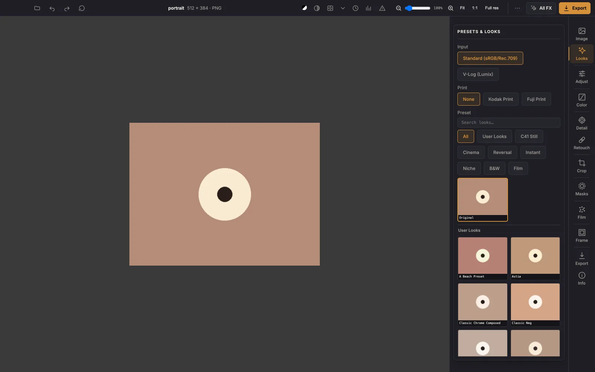
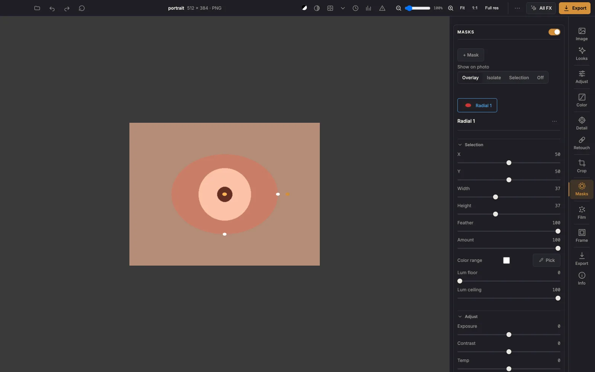
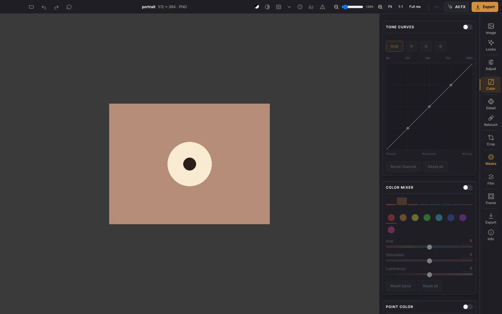
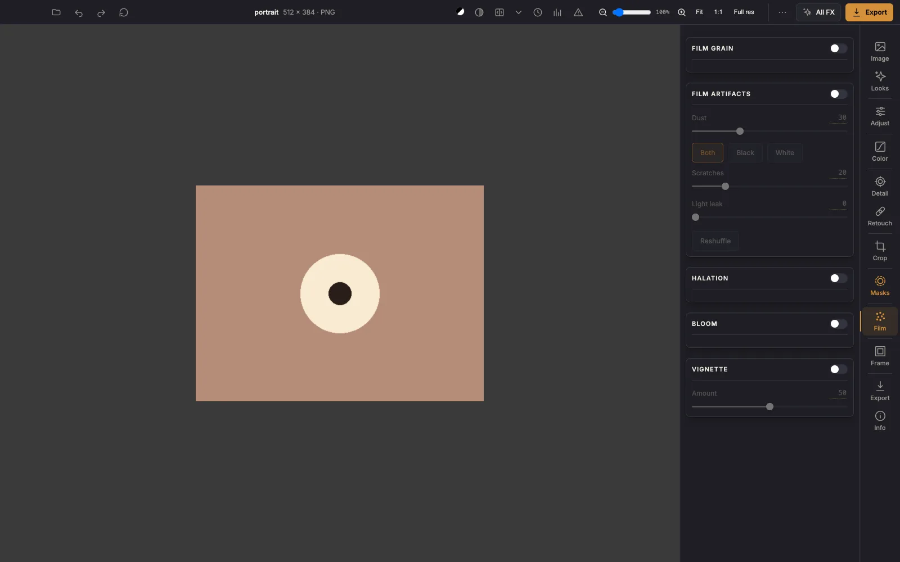
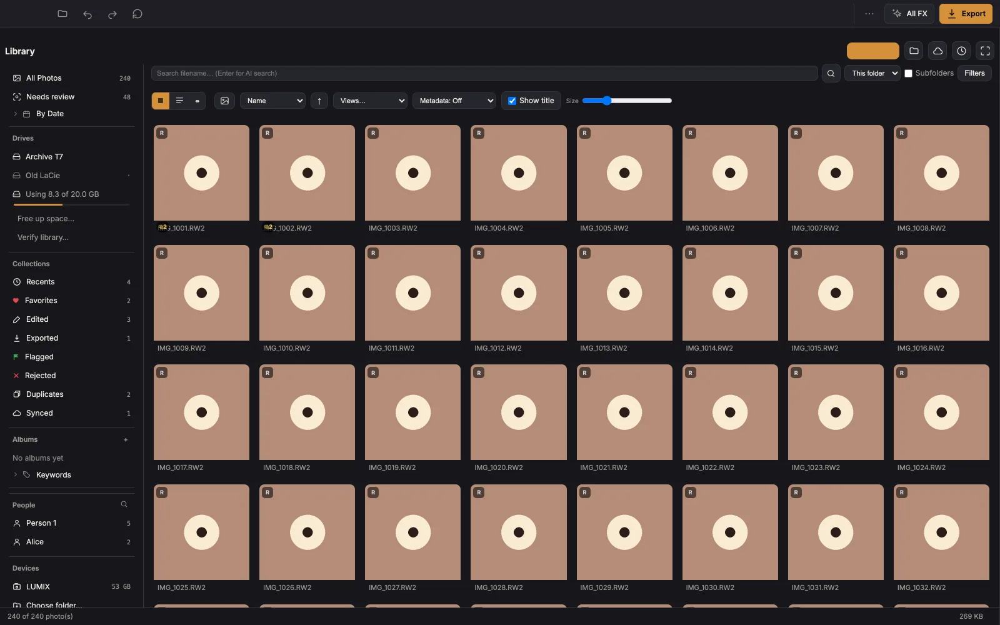
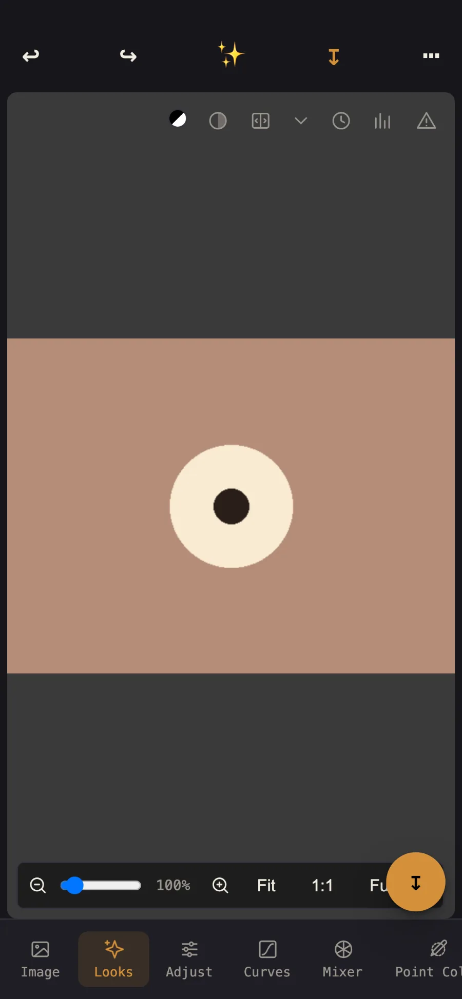

<h1>Chromasmith</h1>

**Film looks for your photos — running entirely on your own device.**

A free photo editor with 113 calibrated film emulations, real grain and halation, RAW support,
local adjustments and full-resolution export. No account, no upload, no subscription. The web
version is a single HTML file with no build step and no server behind it.

**→ [Open the app](https://tareqameer.github.io/Chroma-App/app/) ·
[Product page](https://tareqameer.github.io/Chroma-App/) ·
[Mac download](https://github.com/TareqAmeer/Chroma-App/releases/latest)**

[](https://github.com/TareqAmeer/Chroma-App/actions/workflows/export-gate.yml)
[](https://github.com/TareqAmeer/Chroma-App/actions/workflows/ios-ipa.yml)




---

## Get it

| | How | Notes |
|---|---|---|
| **Browser** | [Open the app](https://tareqameer.github.io/Chroma-App/app/) | Nothing to install. Works offline after the first visit. |
| **Mac** | [Download the latest `.dmg`](https://github.com/TareqAmeer/Chroma-App/releases/latest) | Unsigned: **right-click → Open** the first time. Intel build; runs under Rosetta on Apple Silicon. Adds the photo library, card import, faces and local AI. |
| **iPhone / iPad** | Open in Safari → Share → **Add to Home Screen** | Or sideload the unsigned IPA from [Actions](https://github.com/TareqAmeer/Chroma-App/actions/workflows/ios-ipa.yml) with Flarestore / AltStore / Sideloadly. |
| **Android** | Open in Chrome → menu → **Add to Home screen** | Same app; the layout switches to a phone shell under 700px. |

Step-by-step instructions for each platform, in plain English, are on the
[product page](https://tareqameer.github.io/Chroma-App/#get).

## What it does

**Looks and film**
- 113 film-look presets (Kodak, Fuji, cinema, instant, reversal, B&W), plus any `.cube` you own
- Kodak / Fuji **print profiles** applied after the film look, in the right order
- **Grain** calibrated per film format (8mm → 65mm), **halation** and **bloom** from a measured
  light-scatter model, film **artifacts** (dust, hairs, scratches, light leak)
- Procedural **film frames** — 35mm sprockets, rebate and edge printing drawn to ISO/SMPTE geometry

**Editing**
- Exposure, contrast, white balance, dehaze, sharpening, noise reduction
- **Tone curves** (master + R/G/B) and an eight-band **colour mixer**
- **Local adjustments** — up to 8 masks: radial, linear, brush, sky, AI subject, colour range,
  luminance range; each with amount, texture, clarity and an edge-aware refine
- **Skin tone** — a contractive operator that evens out patchy tone instead of shifting all of it
- **Heal and clone** applied before grading, so a repair takes the same grain and look
- Crop, rotate, straighten, **auto-level**, perspective correction, borders and canvas mattes
- Multi-photo batches with a filmstrip, shared edits, and **match a series to one reference**

**Input and output**
- **RAW** (RW2/RAW) decoded locally, with Adobe DCP camera profiles for LR-like colour
- **V-Log** input transform for Lumix footage and stills
- Full-resolution export to JPEG / PNG / WebP / TIFF, XMP sidecars, **HDR gain-map** HEIC from RAW
- Build a `.cube` LUT from a before/after pair, or match colour from a reference image
- Emitted `.cube` files are tagged for **Lumix Lab**, so a look can go back into the camera

**Desktop only** (the Mac app)
- A full **photo library**: folders, catalog, collections, keywords, duplicates, culling
- **Card import** from an SD card, organised by capture date, with a verified second copy
- **People** — local face detection, recognition and naming
- **Natural-language search** — describe a photo and find it, locally
- Lightroom **Edit In** round-trip and a Lightroom cloud browser

**Video**
- Grade a clip with the same stack as stills, trim it, and export with audio passed through
  untouched; scopes, safe-area guides, fades, gate weave and film breath

## Screenshots

| | |
|---|---|
|  |  |
| Film looks, one tap | Masks and local adjustments |
|  |  |
| Tone curves and colour mixer | Grain, halation and artifacts |
|  |  |
| The desktop photo library | The same app on a phone |

## What's new

- **Card import** — copy a shoot straight off an SD card, organised into date folders, never moved
- **People and natural-language search** — find someone, or describe a photo, entirely on-device
- **Heal and clone** — spot removal that happens before grading, so repairs never look pasted in
- **Auto-level** — finds the dominant line and straightens it (worst error 0.30° on ground truth)
- **Match series to a reference** — fixes exposure/WB drift across a shoot without touching the look
- **Film frames** — sprocket holes and edge printing from real 35mm measurements
- **Video grading** — one clip, the full stack, audio remuxed rather than re-encoded
- **HDR export from RAW** — gain-map HEIC derived from the app's own extended-range decode

Full history: [commits on main](https://github.com/TareqAmeer/Chroma-App/commits/main).

## Privacy

No account, no telemetry, no uploads, no backend. Photos are read, processed and written on the
device you are using. The web build works with the network disconnected after its first load.

---

## For developers

### Run it

```bash
python3 -m http.server 8000   # then open http://localhost:8000/
```

There is no build step. `chromasmith-22.html` is the entire web app — HTML, CSS, JS and GLSL
shaders in one file. `index.html` is the product page; the editor is at `/app/`.

RAW decoding in the browser needs cross-origin isolation (`SharedArrayBuffer`), which GitHub Pages
cannot set headers for — `coi-serviceworker.min.js` enables it client-side and reloads once on the
first visit. Everything else works without it.

### Tests

```bash
npm test              # everything below, in order
node test/export_harness.mjs           # 18 golden renders, byte-exact
node test/export_harness.mjs --golden  # regenerate goldens (only when a change is intended)
npm run ui:test       # desktop + phone layout audit
npm run perf:test     # performance budgets
npm run lib:test      # library grid scaling
npm run video:test    # video demux/seek/export
```

`test/export_harness.mjs` drives the real HTML in headless Chromium with software GL, so output
does not depend on the host GPU. After **any** shader edit, run it and watch for
`[console.error] GLSL compile error` — a failed shader compile does not break the page, it
silently switches the affected feature off.

### The site

```bash
node site/shoot-screenshots.mjs   # re-capture the UI screenshots from the real app
node site/build-assets.mjs        # optimise photos from site/photos-src/
node site/build-page.mjs          # inject them into index.html
```

See [site/README.md](site/README.md).

### Desktop app (macOS, Tauri)

```bash
cd desktop && npm ci
# fetch the AI models — each vendor dir's README has the exact curl commands
./install-app.sh                  # builds and installs into /Applications
```

Needs Rust, Node and Xcode command-line tools. The ONNX models (~1.1 GB) are not in git; see
`desktop/src-tauri/vendor/*/README.md` for where each one comes from and
[LICENSES-MODELS.md](LICENSES-MODELS.md) for their licences.

### iOS app (Capacitor)

```bash
npm ci && ./build-ios.sh && npx cap sync ios
```

CI builds an unsigned IPA on every push
([workflow](https://github.com/TareqAmeer/Chroma-App/actions/workflows/ios-ipa.yml)); this machine
has no Xcode, so CI is the only build path.

### Repository layout

```
index.html                 The product page (GitHub Pages root)
app/index.html             Clean /app/ URL → the editor
chromasmith-22.html        THE ENTIRE WEB APP — HTML + CSS + JS + GLSL in one file
coi-serviceworker.min.js   Cross-origin-isolation shim so RAW decoding works on Pages
site/                      Landing-page assets + the scripts that generate them
vendor/                    LibRaw wasm, DCP camera profiles, mediabunny, 102 look LUTs, frames
desktop/                   Tauri macOS shell: native RAW, the photo library, on-device AI
ios/                       Capacitor iOS shell
test/                      Export/UI/perf/mask/library/video regression gates
calib/                     Python calibration + analysis tooling (not needed to run the app)
CLAUDE.md                  Developer handoff: architecture, calibration science, hard-won lessons
ROADMAP.md                 Feature roadmap with measured notes
```

## Third-party components

LibRaw (wasm RAW decoder) · Adobe DCP camera profiles for the Panasonic DC-S9 ·
[mediabunny](https://github.com/Vanilagy/mediabunny) MP4 demux/mux, MPL-2.0 ·
[coi-serviceworker](https://github.com/gzuidhof/coi-serviceworker), MIT ·
pako · utif2 · Inter and Instrument Serif (SIL OFL 1.1) · Lucide-shaped icon set (ISC) ·
the Monk Skin Tone scale (CC BY 4.0) · on-device ONNX models — see
[LICENSES-MODELS.md](LICENSES-MODELS.md).

## Licence

GPL-3.0. See [LICENSE](LICENSE).
