<h1>Chromasmith</h1>

**Gallery. Studio. Film Lab**

your photos. your workflow. your app.

Make a look in a click or take control of every detail. Chromasmith is a free photo studio with
133 calibrated film looks, real grain, halation and bloom, RAW development, masks and retouching,
a local photo library and full-resolution export — running entirely on your own device. No
account, no upload, no subscription. The web version is a single HTML file with no build step
and no server behind it.

**→ [Open the app](https://tareqameer.github.io/Chroma-App/app/) ·
[Product page](https://tareqameer.github.io/Chroma-App/) ·
[Mac & Windows downloads](https://github.com/TareqAmeer/Chroma-App/releases/latest)**

[](https://github.com/TareqAmeer/Chroma-App/actions/workflows/export-gate.yml)
[](https://github.com/TareqAmeer/Chroma-App/actions/workflows/ios-ipa.yml)


**Jump to:** [Get it](#get-it) · [Highlights](#highlights) · [All features](#complete-feature-list) · [FAQ](#faq) · [Known limitations](#known-limitations) · [Privacy](#privacy) · [For developers](#for-developers)

<p align="center">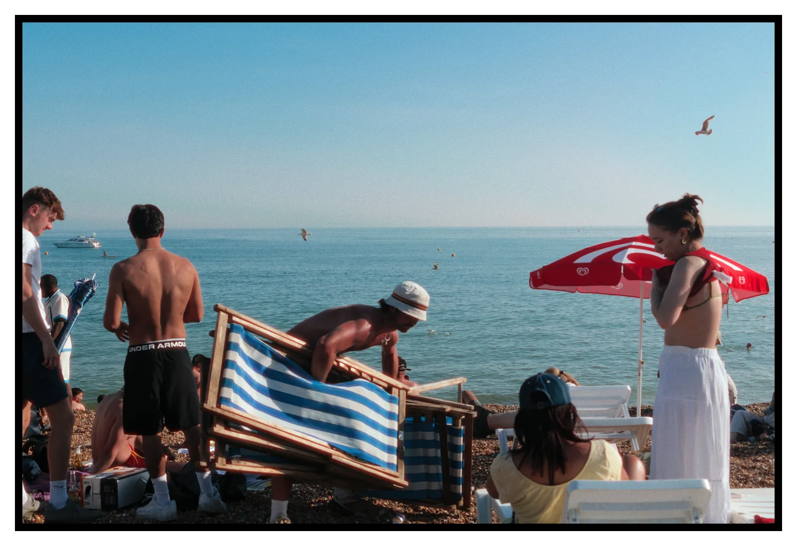</p>

### From raw photo to finished frame

<table>
<tr>
<td width="33%">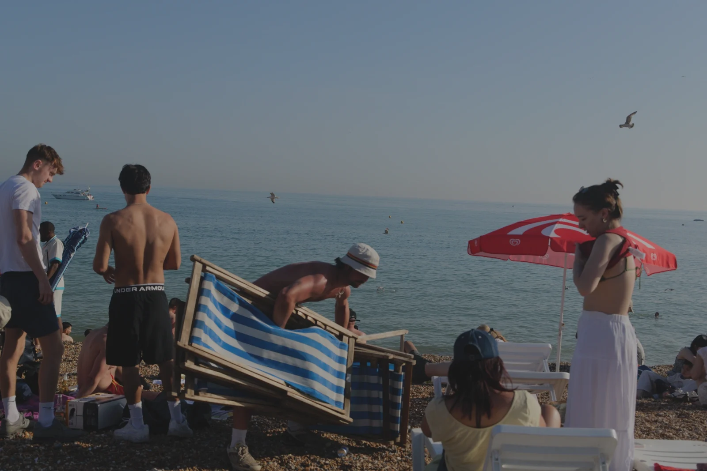<br><sub><b>1 · Raw photo</b></sub></td>
<td width="33%">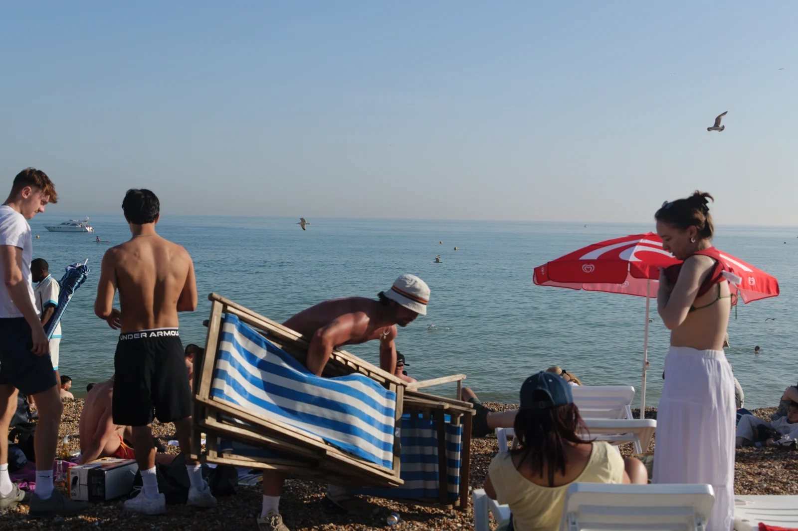<br><sub><b>2 · Edit it</b></sub></td>
<td width="33%"><br><sub><b>3 · Colour it</b></sub></td>
</tr>
<tr>
<td>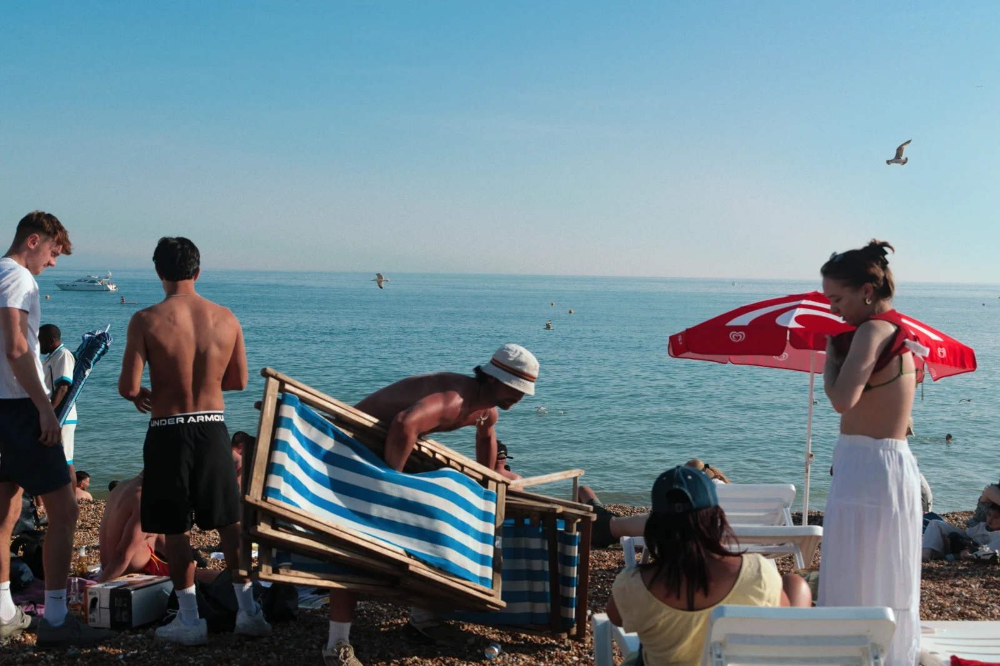<br><sub><b>4 · Sprinkle some grain</b></sub></td>
<td>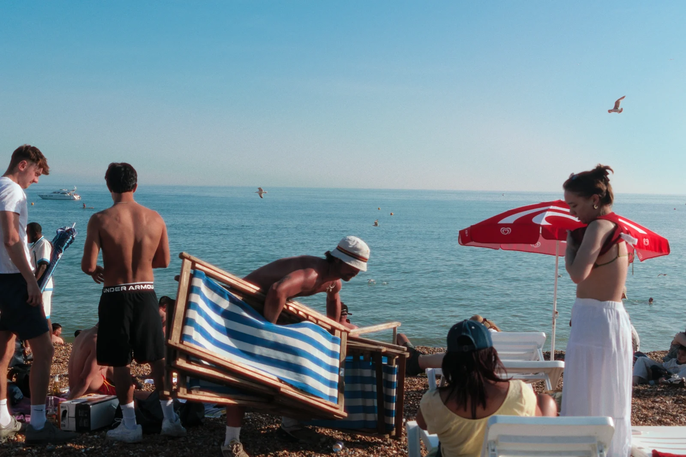<br><sub><b>5 · Make it glow</b></sub></td>
<td><br><sub><b>6 · Frame it twice</b></sub></td>
</tr>
</table>

### A gallery for every shoot

Faces, pets, favourites and keywords are found for you, on your own machine. Click a photo to preview it, or try a filter.

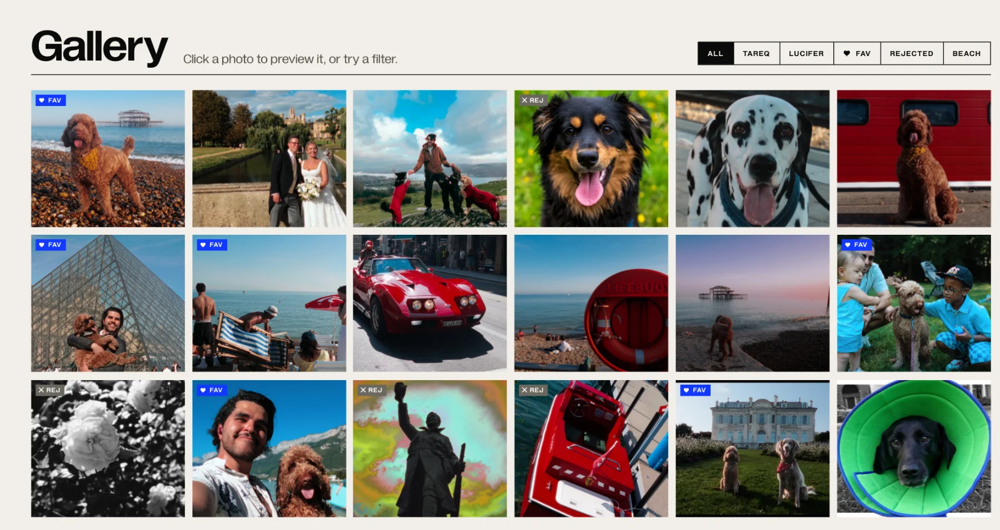

### A studio for every frame

Six tools, one editor: pick a look, shape the light and colour, add texture, then crop and frame for output.

<table>
<tr>
<td width="33%">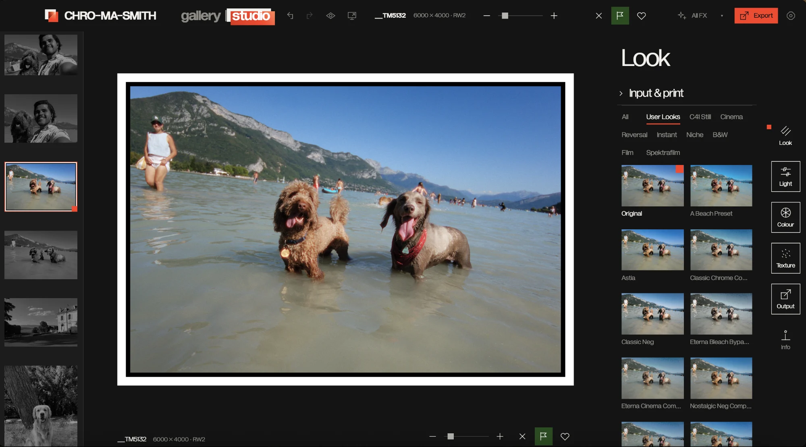<br><sub><b>Look</b> · film presets and print</sub></td>
<td width="33%">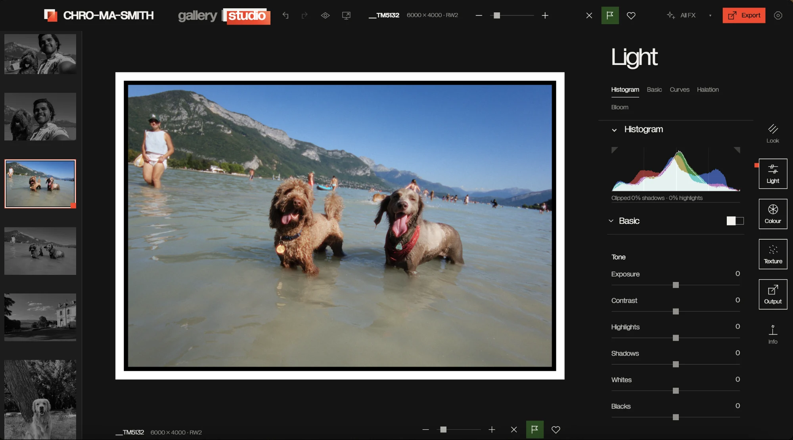<br><sub><b>Light</b> · tone, curves, halation, bloom</sub></td>
<td width="33%">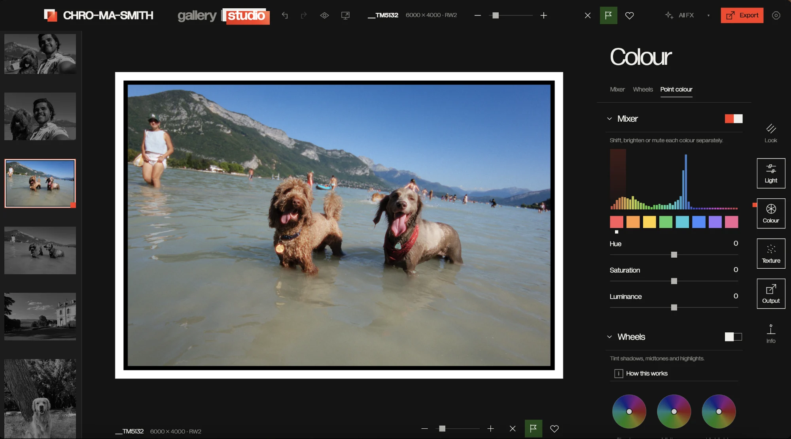<br><sub><b>Colour</b> · mixer, wheels, point colour</sub></td>
</tr>
<tr>
<td>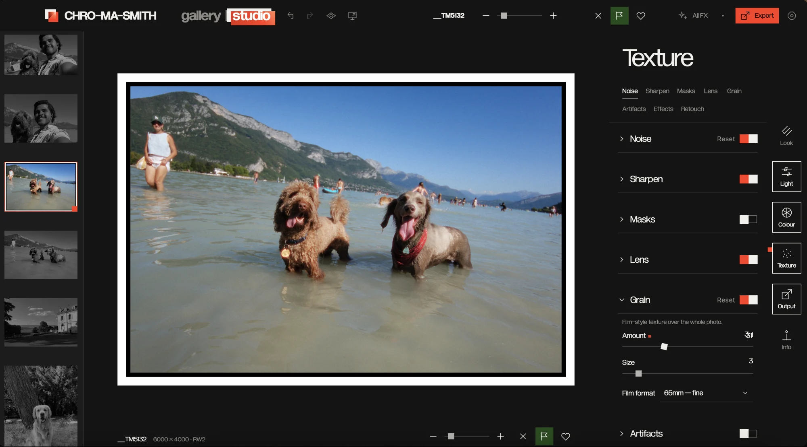<br><sub><b>Texture</b> · grain, sharpen, noise, masks</sub></td>
<td>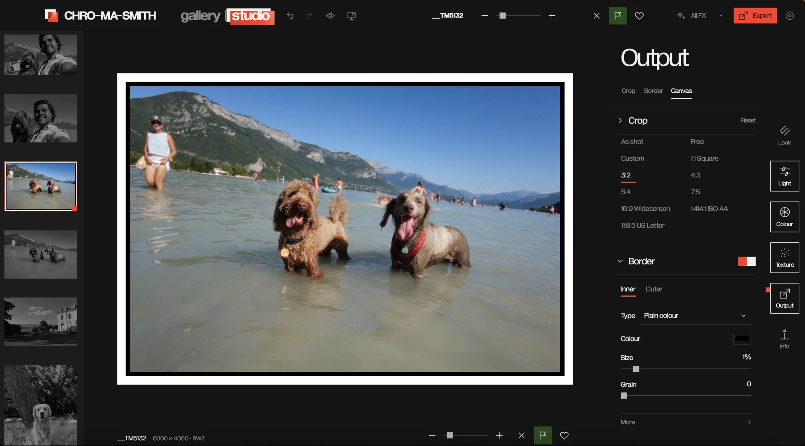<br><sub><b>Output</b> · crop, borders, film frames</sub></td>
<td>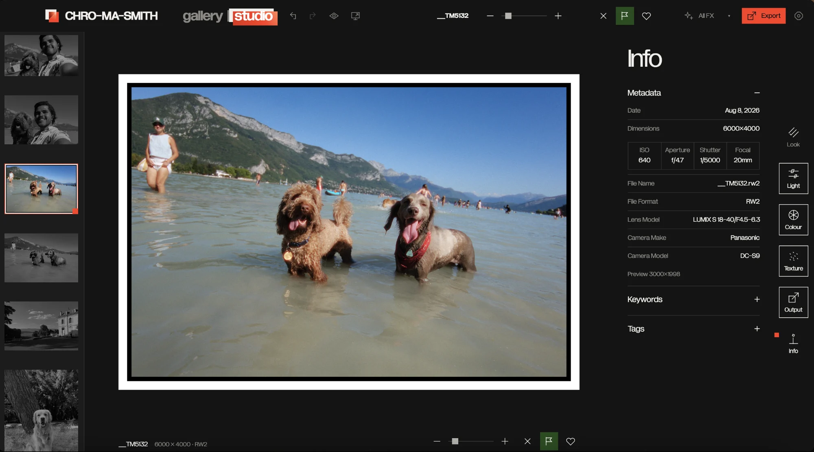<br><sub><b>Info</b> · camera details, keywords, tags</sub></td>
</tr>
</table>

---

## Get it

| | How | Notes |
|---|---|---|
| **Browser** | [Open the app](https://tareqameer.github.io/Chroma-App/app/) | Nothing to install. Works offline after the first visit. |
| **Mac** | [Download the latest `.dmg`](https://github.com/TareqAmeer/Chroma-App/releases/latest) | Unsigned: **right-click → Open** the first time. Intel build; runs under Rosetta on Apple Silicon. Adds the photo library, card import, faces and local AI. |
| **Windows** | [Download the latest `windows-x64-setup.exe`](https://github.com/TareqAmeer/Chroma-App/releases/latest) | Windows 10/11, 64-bit. Unsigned: if SmartScreen appears, choose **More info → Run anyway**. The same full desktop app as on Mac: library, card import, faces and local AI. |
| **iPhone / iPad** | Open in Safari → Share → **Add to Home Screen** | Or sideload the unsigned IPA from [Actions](https://github.com/TareqAmeer/Chroma-App/actions/workflows/ios-ipa.yml) with Flarestore / AltStore / Sideloadly. |
| **Android** | Open in Chrome → menu → **Add to Home screen** | Same app; the layout switches to a phone shell under 700px. |

**Requirements:** any current Chrome, Edge, Firefox or Safari with WebGL2 · Mac: macOS on Intel, or Apple Silicon via Rosetta · Windows: 10/11, 64-bit (installer ~395 MB, includes the on-device AI models) · iPhone/iPad: iOS Safari.

Step-by-step instructions for each platform, in plain English, are on the
[product page](https://tareqameer.github.io/Chroma-App/#get).

## Highlights

- **One click is all it takes** — 133 film looks across Kodak, Fuji, cinema, instant, reversal and B&W, previewed live on your photo
- **Let the light linger** — grain, halation, bloom, dust, light leaks and film frames, each with room to be subtle or unmistakable
- **A studio for every frame** — curves, an eight-band colour mixer, lift/gamma/gain, masks, heal and clone, full-resolution export
- **A library for every shoot** — folders, culling, people and natural-language search, all on your machine (desktop app)
- **Works with no signal** — no account, no upload; the web app runs offline after the first visit
- **Beta, growing** — video grading, astro stacking and two-photo panorama

Every tool is in the [complete feature list](#complete-feature-list) below; the
[product page](https://tareqameer.github.io/Chroma-App/) has the full tour.

## Complete feature list

<details><summary><b>Looks and film</b> (13)</summary>

- **133 film looks** — Start with calibrated colour, cinema, instant, reversal or black-and-white looks.
- **One-tap Looks gallery** — Preview a look on your photo and apply it with one click.
- **Custom .cube LUTs** — Load a LUT you already own and use it as the starting look.
- **Kodak and Fuji print profiles** — Add a print-film response after the base look.
- **Film grain** — Add grain shaped for formats from 8mm to 65mm.
- **Halation** — Let bright edges glow into neighbouring dark areas.
- **No-remjet halation** — Push halation toward a stronger, stylised glow.
- **Bloom** — Give bright areas a softer spread of light.
- **Film dust and scratches** — Layer procedurally placed dust, hairs and scratches onto the image.
- **Light leaks** — Add warm film-like light intrusions and reshuffle their placement.
- **Film frames** — Finish with sprockets, rebates and edge printing.
- **Vignette** — Draw attention inward by shaping the edge brightness.
- **Reusable Styles** — Save a finished editing recipe and apply it again later.

</details>

<details><summary><b>Light and colour</b> (15)</summary>

- **Exposure** — Brighten or darken the image without changing the chosen look.
- **Contrast** — Shape the separation between lighter and darker tones.
- **White balance** — Adjust temperature and tint to make the colour feel right.
- **White-balance eyedropper** — Click a neutral area to correct the colour cast.
- **Auto-enhance** — Set a quick starting point for levels and white balance.
- **Master tone curve** — Draw the overall tonal response directly.
- **RGB channel curves** — Shape the red, green and blue channels independently.
- **Parametric curves** — Adjust shadows, darks, lights and highlights with four controls.
- **Eight-band colour mixer** — Tune hue, saturation and luminance by colour band.
- **Lift, gamma and gain wheels** — Tint shadows, midtones and highlights separately.
- **Dehaze** — Recover clarity in flat or hazy scenes.
- **Noise reduction** — Quiet unwanted image noise while keeping useful detail.
- **Sharpening** — Restore crispness at the level the image needs.
- **Deconvolution sharpening** — Recover detail softened by lens or sensor blur.
- **Highlight roll-off** — Keep bright regions gentler with filmic tone-mapping options.

</details>

<details><summary><b>Masks and retouching</b> (14)</summary>

- **Radial masks** — Make a soft oval adjustment around a subject or light source.
- **Linear masks** — Grade one side of the frame with a graduated transition.
- **Brush masks** — Paint an adjustment exactly where it belongs.
- **Sky masks** — Separate the sky for its own grade.
- **AI subject masks** — Select a subject from the photo for local editing.
- **Colour-range masks** — Target pixels by colour rather than by location.
- **Luminance-range masks** — Target an adjustment to a chosen brightness range.
- **Depth masks** — Use estimated scene depth to separate near and far areas on desktop.
- **Mask edge refinement** — Snap rough mask edges toward real image boundaries.
- **Skin-tone tools** — Even out patchy skin colour while keeping the image's character.
- **Face-feature exclusion** — Keep eyes, lips and other facial details out of a skin adjustment.
- **Named-subject masks** — Teach a subject from examples and find it again in other photos.
- **Heal** — Blend away a spot before the film look and grain are applied.
- **Clone** — Copy a source area precisely to repair the frame.

</details>

<details><summary><b>Composition and multi-image</b> (10)</summary>

- **Crop and aspect ratio** — Reframe the photo for its final destination.
- **Rotate and flip** — Change image orientation without leaving the editor.
- **Straighten and auto-level** — Level the horizon manually or let the app find a dominant line.
- **Perspective correction** — Bring leaning lines back into shape.
- **Borders and canvas mattes** — Place the image inside a chosen border, aspect and background.
- **Collage layouts** — Place multiple images in adjustable rows, columns and grids.
- **HDR merge** — Blend bracketed exposures into one image on desktop.
- **Focus stacking** — Combine frames focused at different distances on desktop.
- **Astro stacking — beta** — Stack night-sky captures from the desktop library.
- **Two-photo panorama — beta** — Stitch a pair of photos into one wider image.

</details>

<details><summary><b>Desktop photo library</b> (13)</summary>

- **Local library** — Browse your archive on your machine without uploading it.
- **Folder and collection browsing** — Move through folders, dates and curated groups of images.
- **SD-card import** — Copy a shoot by capture date and make a verified second copy.
- **Keywords** — Add searchable words to describe and group photos.
- **Duplicate detection** — Find repeated files while reviewing the library.
- **Culling** — Pick the keepers from a shoot before editing.
- **People recognition** — Find and name faces with processing on your device.
- **Natural-language search** — Describe a photo in words and search locally for it.
- **Suggested tags** — Get on-device tag suggestions for a selected photo.
- **Virtual copies** — Keep more than one edit version of the same photo.
- **Offline edits** — Work from a cached preview and apply the edit when the source returns.
- **Lightroom round-trip** — Open a Lightroom photo in Chromasmith and return the result.
- **Lightroom cloud browser** — Browse connected Lightroom cloud photos from the desktop app.

</details>

<details><summary><b>Input, export and workflow</b> (19)</summary>

- **RAW decoding** — Open camera RAW files and develop them locally.
- **DCP camera profiles** — Use camera colour profiles for more faithful RAW starting colour.
- **V-Log input** — Convert Lumix V-Log material before grading it.
- **Multi-photo filmstrip** — Load several images and switch between their previews.
- **Shared and per-photo edits** — Apply a look to the batch, then adjust an individual frame.
- **Match a series** — Align exposure and white balance across a shoot to one reference photo.
- **Before-and-after comparison** — Check your grade against the original image.
- **Live histogram** — Watch tonal distribution while you edit.
- **1:1 loupe** — Inspect the full rendering pipeline at native image scale.
- **Undo and redo** — Move safely backward and forward through editing decisions.
- **Session save and restore** — Keep slider settings locally and return to them later.
- **Full-resolution export** — Render the finished image at its original resolution.
- **JPEG, PNG, WebP and TIFF** — Choose the output format that suits the job.
- **HDR gain-map HEIC** — Export extended-range highlights from a RAW source.
- **XMP sidecars** — Keep an edit record alongside the source file.
- **Export presets** — Save quality, format, resize and sharpening settings as a preset.
- **LUT from a before/after pair** — Build a reusable .cube look from two versions of one image.
- **Colour Copy** — Match a reference image's colour into a .cube LUT or XMP preset.
- **Lumix Lab LUT export** — Tag a .cube file for a look you can take back to a Lumix camera.

</details>

<details><summary><b>Video — beta</b> (8)</summary>

- **Clip grading** — Use the still-photo look stack on a video clip.
- **Trim in and out** — Choose the segment of a clip to export.
- **Audio passthrough** — Keep the source audio without re-encoding it.
- **Scopes** — Read the clip's signal as you grade.
- **Safe-area guides** — Check framing with overlay guides.
- **Fades** — Ease the picture in or out of a clip.
- **Gate weave and film breath** — Add restrained analogue motion to a graded clip.
- **Frame capture** — Export the current video frame as a still image.

</details>

<details><summary><b>Access and privacy</b> (8)</summary>

- **Browser editor** — Open the app without installing a desktop package.
- **Phone layout** — Edit with a touch-first tool sheet on a smaller screen.
- **Offline web use** — Keep editing after the first load when the connection goes away.
- **Home-screen install** — Add the web app to your phone's home screen.
- **Swipe between photos** — Move through a loaded batch with a touch gesture.
- **Hold to compare** — Press and hold on mobile to check the original.
- **On-device processing** — Keep your photos on the device where you edit them.
- **No account or subscription** — Open the free, open-source app without signing in.

</details>

## FAQ

**Is Chromasmith really free?**  
Yes. It's free, open-source software under the GPL-3.0 licence. There's no account, subscription or paywall.

**Do my photos get uploaded anywhere?**  
No. Everything runs on your device, in the browser or the desktop app. Your photos never leave your machine.

**What's the difference between the web app and the desktop app?**  
The web app has the full editor: looks, film effects, colour tools, masks and export. The desktop app adds the photo library, card import, on-device search, face tagging and the desktop-only tools such as HDR and focus stacking.

**Does it work offline?**  
Yes. After the first load the web app keeps working without a connection, and the desktop app never needs one.

**Which RAW files can it open?**  
Camera RAW files from any camera are decoded locally on your device. JPEG, PNG and TIFF open everywhere.

**Can I use my own LUTs?**  
Yes. Load any .cube LUT as a starting look, or build your own .cube from a before/after pair or a reference photo.

**How do I install it on iPhone?**  
Chromasmith isn't on the App Store yet. Download the .ipa and install it with a third-party signing service such as Flarestore. Or add the web app to your home screen, which needs no signing.

**Where can I see every feature in a list?**  
Open the [full feature list](#complete-feature-list). Every tool, grouped by what it does, with a one-line description.

**Is there a Windows version?**  
Yes. A 64-bit Windows 10/11 installer is published on the [releases page](https://github.com/TareqAmeer/Chroma-App/releases/latest) alongside the Mac build, with the same library, import and on-device AI features.

**What is it made with?**  
The whole editor is one HTML file with plain JavaScript and no framework or build step. Rendering runs on WebGL2, with GLSL shaders for the look, grain, halation, bloom and tiled full-resolution export. RAW files are decoded locally with LibRaw compiled to WebAssembly, plus Adobe DCP camera profiles. The desktop app is a Tauri shell with a Rust core and a local catalogue database, for Mac and Windows. On-device masks use ONNX Runtime models (EdgeSAM and SegFormer). Video uses mediabunny, the iPhone app is a Capacitor shell, and the film looks were calibrated with Python tooling. It works offline through a service worker, and the source is GPL-3.0.

## Known limitations

- **Unsigned apps.** The Mac, Windows and iPhone builds aren't signed yet, so each system shows a one-time warning on first launch.
- **Beta features.** Video grading, astro stacking and panorama (two photos only) are still in progress.
- **Desktop-only tools.** The photo library, card import, people, search, depth masks, HDR merge and focus stacking need the Mac or Windows app.
- **Phones.** The phone layout is touch-first; large RAW files and full-resolution exports are limited by the phone's memory.
- **Not on the App Store** yet; iPhone installs go through the home screen or sideloading.

## Privacy

No account, no telemetry, no uploads, no backend. Photos are read, processed and written on the
device you are using. The web build works with the network disconnected after its first load.

---

## For developers

No build step: serve the folder and open it.

```bash
python3 -m http.server 8000   # then open http://localhost:8000/
```

Tests, desktop and iOS builds, the site generators and the repository layout are in
**[CONTRIBUTING.md](CONTRIBUTING.md)**. Architecture and calibration notes live in [CLAUDE.md](CLAUDE.md) and [docs/](docs/).

## Third-party components

LibRaw (wasm RAW decoder) · Adobe DCP camera profiles for the Panasonic DC-S9 ·
[mediabunny](https://github.com/Vanilagy/mediabunny) MP4 demux/mux, MPL-2.0 ·
[coi-serviceworker](https://github.com/gzuidhof/coi-serviceworker), MIT ·
pako · utif2 · Inter and Instrument Serif (SIL OFL 1.1) · Lucide-shaped icon set (ISC) ·
the Monk Skin Tone scale (CC BY 4.0) · on-device ONNX models — see
[LICENSES-MODELS.md](LICENSES-MODELS.md).

## Licence

GPL-3.0. See [LICENSE](LICENSE).
